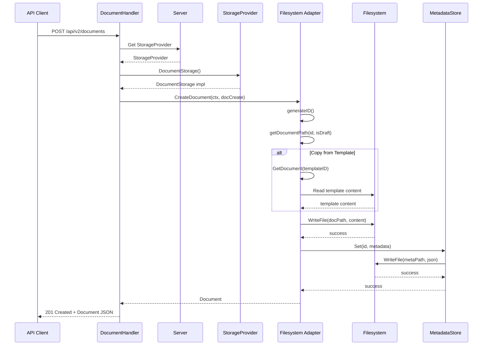
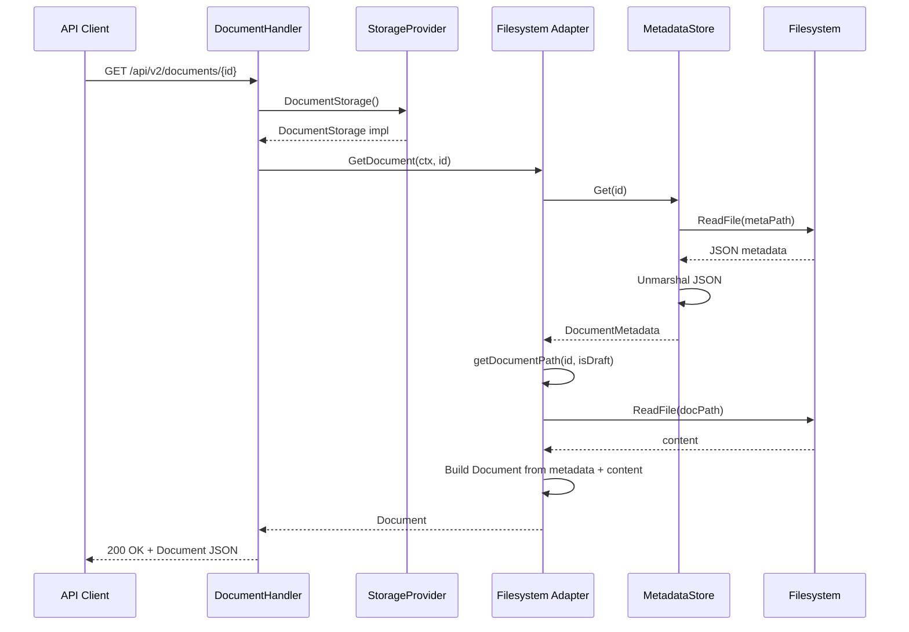
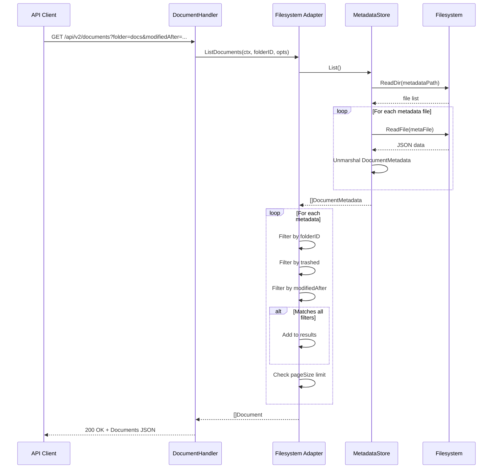
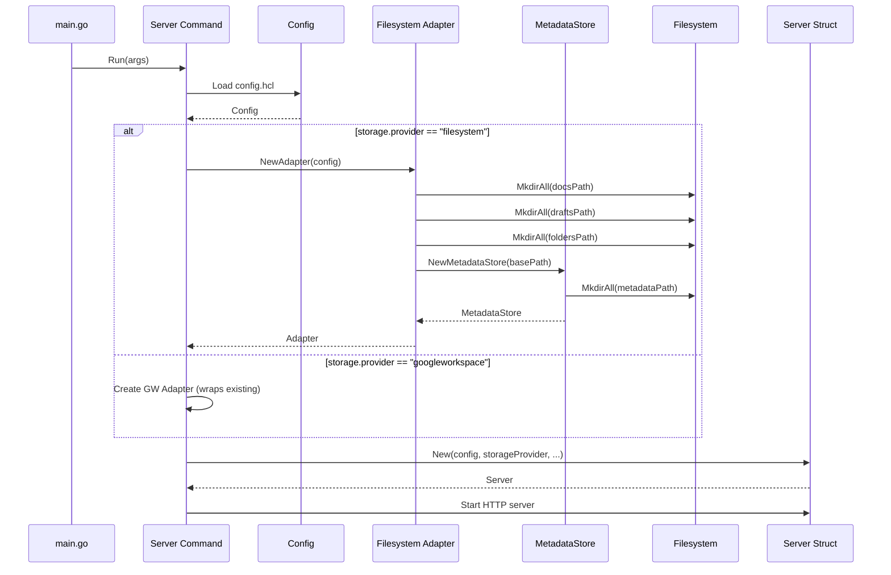
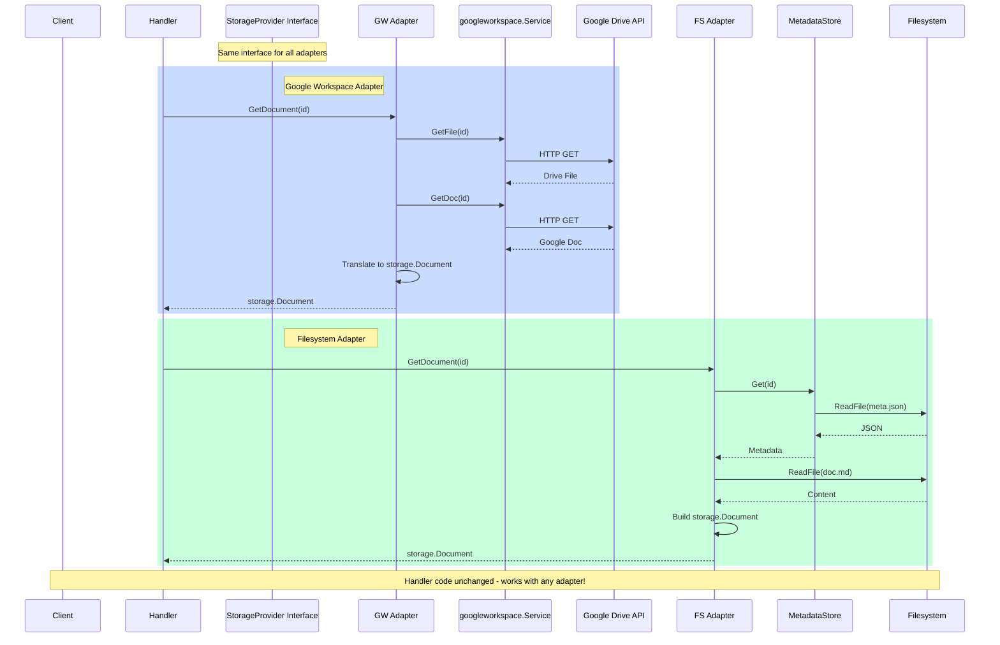
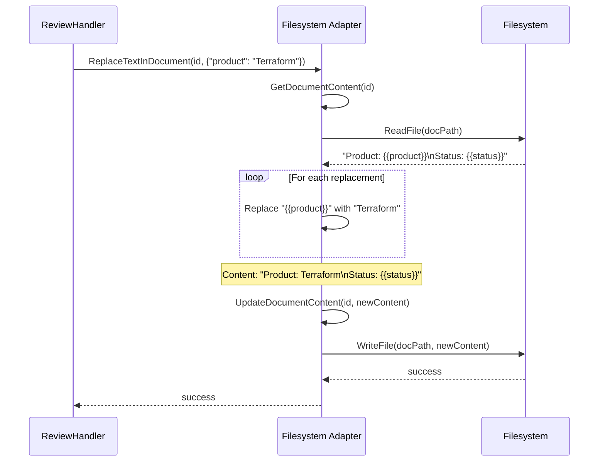
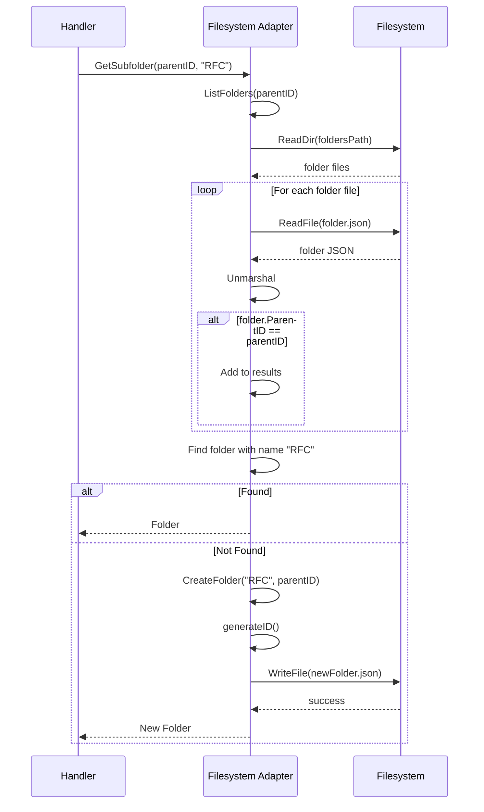
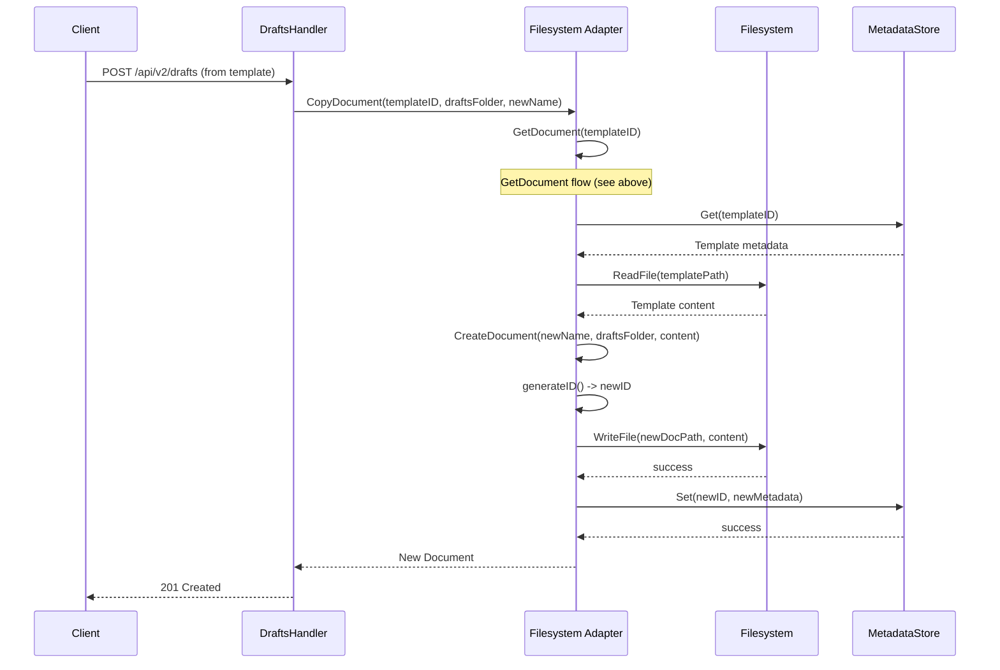
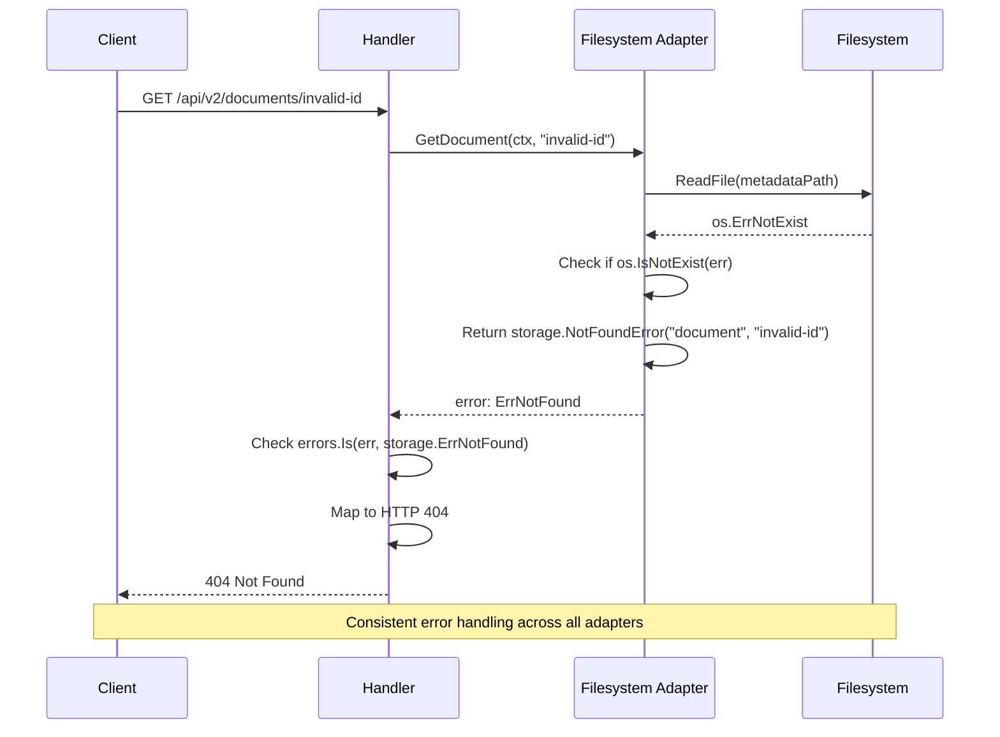
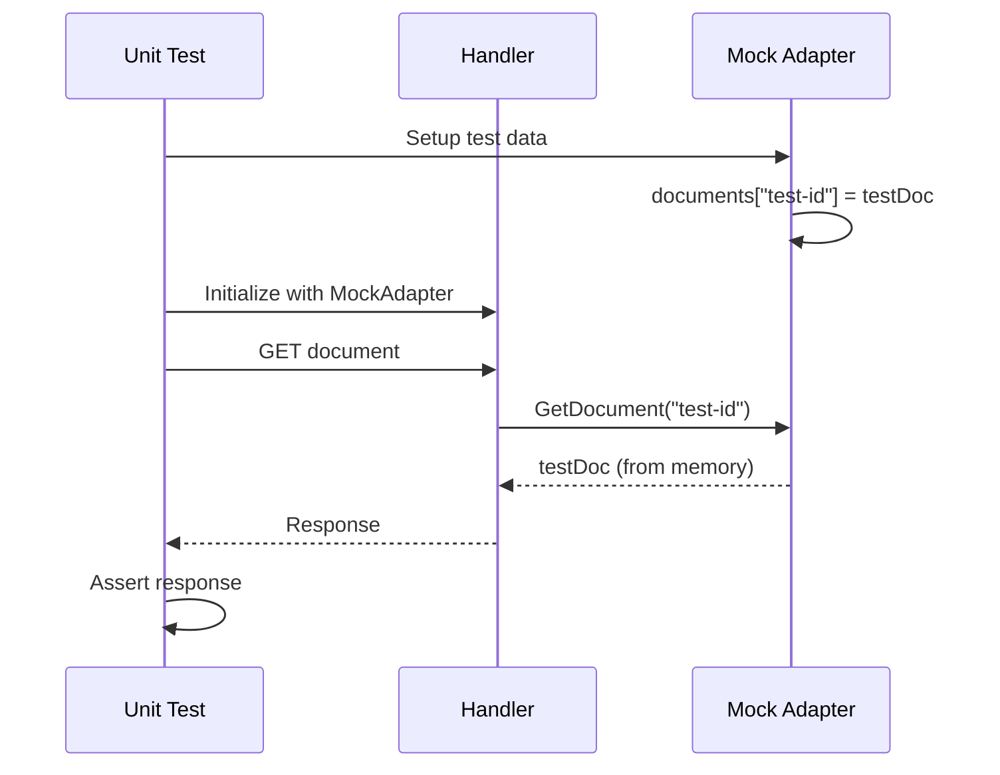

# Storage Abstraction - Sequence Diagrams

This document contains sequence diagrams showing the flow of operations through the storage abstraction layer.

## Document Creation Flow



## Document Retrieval Flow



## Document List with Multiple Filters



## Storage Provider Initialization



## Multi-Adapter Comparison



## Text Replacement Operation



## Folder Operations



## Document Copy Operation



## Error Handling Flow



## Architecture Overview

```
┌─────────────────────────────────────────────────────────────┐
│                        API Layer                             │
│  DocumentHandler, DraftsHandler, ReviewHandler, etc.        │
└─────────────────────┬───────────────────────────────────────┘
                      │ Uses
                      ▼
┌─────────────────────────────────────────────────────────────┐
│              Storage Abstraction Layer                       │
│                                                              │
│  ┌────────────────────────────────────────────────────┐    │
│  │         StorageProvider Interface                   │    │
│  │  • DocumentStorage()                                │    │
│  │  • PeopleService()                                  │    │
│  │  • NotificationService()                            │    │
│  │  • AuthService()                                    │    │
│  └────────────────────────────────────────────────────┘    │
└───────────┬─────────────────────────┬──────────────────────┘
            │                         │
            ▼                         ▼
┌──────────────────────┐   ┌──────────────────────────┐
│ Google Workspace     │   │  Filesystem Adapter      │
│     Adapter          │   │                          │
├──────────────────────┤   ├──────────────────────────┤
│ • Wraps GW Service   │   │ • Local files (.md)      │
│ • Translates types   │   │ • JSON metadata          │
│ • Drive API          │   │ • Directory structure    │
│ • Docs API           │   │ • users.json             │
│ • People API         │   │ • SMTP notifications     │
│ • Gmail API          │   │ • Token-based auth       │
└──────────┬───────────┘   └────────┬─────────────────┘
           │                        │
           ▼                        ▼
┌──────────────────────┐   ┌──────────────────────────┐
│  Google Cloud APIs   │   │   Operating System       │
│  • Drive v3          │   │   • File I/O             │
│  • Docs v1           │   │   • Directory ops        │
│  • Gmail v1          │   │   • JSON marshal         │
│  • People v1         │   │                          │
└──────────────────────┘   └──────────────────────────┘
```

## Key Benefits Illustrated

### 1. Same Handler Code, Different Backends

```go
// Handler code (unchanged)
func DocumentHandler(srv server.Server) http.Handler {
    docStorage := srv.StorageProvider.DocumentStorage()
    doc, err := docStorage.GetDocument(ctx, id)
    // ... works with any adapter!
}
```

### 2. Easy Testing with Mock Adapter



### 3. Gradual Migration Path

```
Phase 1: Create interfaces         ✓ No changes to handlers
Phase 2: Wrap Google Workspace     ✓ Still using Google APIs
Phase 3: Migrate handlers           ✓ One at a time
Phase 4: Add filesystem option      ✓ Choose per deployment
```
